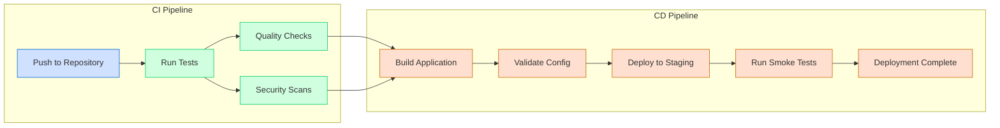

# CI/CD Pipeline

A simple Python project demonstrating a complete CI/CD pipeline using GitHub Actions and `uv` package manager.

## CI/CD Pipeline Steps

This project uses GitHub Actions to implement a CI/CD pipeline with the following stages:

1. **Test**: Runs unit tests with code coverage
2. **Quality**: Performs code quality checks (linting and type checking)
3. **Security**: Scans for security vulnerabilities
4. **Deploy**: Simulates deployment to a staging environment

## CI/CD Pipeline Diagram



## Setup

1. Clone the repository:

   ```bash
   git clone https://github.com/yourusername/my-python-project.git
   cd my-python-project
   ```

2. Install uv (if not already installed):

   ```bash
   curl -LsSf https://astral.sh/uv/install.sh | sh
   ```

3. Create a virtual environment and install dependencies:
   ```bash
   uv sync
   ```

## Running Tests

```bash
uv run pytest
```

With coverage:

```bash
uv run pytest --cov=src
```

## Running Linters and Type Checking

```bash
uv run ruff check .
uv run mypy src/
```

## GitHub Actions Configuration

The workflow is configured to run automatically when:

- Pushing to the `main` or `dev` branch
- Creating a pull request targeting the `main` or `dev` branch

The deployment job only runs on the `main` branch and not on pull requests.

## License

MIT
