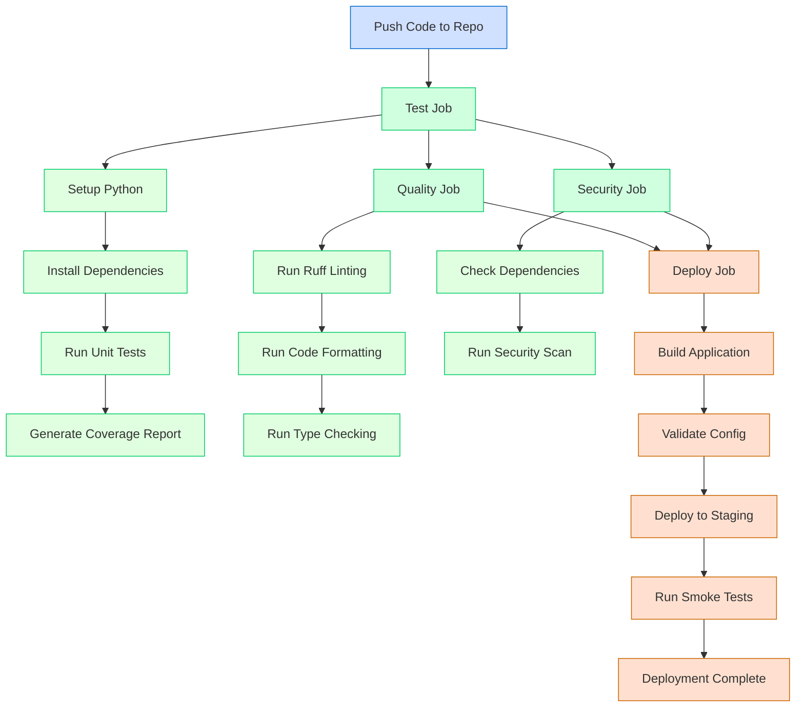

# CI/CD Pipeline Documentation

This document explains the Continuous Integration and Continuous Deployment (CI/CD) pipeline implemented in this project.

## Pipeline Overview

Our CI/CD pipeline automates the process of testing, validating, and deploying the application. It consists of several stages that run sequentially and in parallel to ensure code quality and reliability.



## Pipeline Stages

### 1. Test Stage

The test stage runs unit tests and calculates code coverage.

**Key Steps:**

- Check out the repository
- Set up Python environment
- Install dependencies
- Run pytest with coverage reporting
- Fail if coverage is below 80%

### 2. Quality Stage

The quality stage runs linting and type checking to ensure code quality.

**Key Steps:**

- Run ruff for linting
- Run ruff format for code formatting
- Run mypy for type checking

### 3. Security Stage

The security stage checks for vulnerabilities in dependencies and code.

**Key Steps:**

- Run safety to check dependencies for known vulnerabilities
- Run bandit to scan code for security issues

### 4. Deploy Stage

The deploy stage builds and deploys the application to the staging environment.

**Key Steps:**

- Build the application package
- Run pre-deployment validation
- Deploy to staging environment
- Run smoke tests to verify deployment

## Workflow Diagram

The following diagram shows the detailed workflow of our CI/CD pipeline:

```
┌─────────────────────────────────────────────────────────────┐
│                       GitHub Actions                        │
└─────────────────────────────────────────────────────────────┘
                               │
                               ▼
┌─────────────────────────────────────────────────────────────┐
│                         Test Job                            │
│                                                             │
│  ┌─────────────┐    ┌─────────────┐    ┌─────────────┐      │
│  │  Run Tests  │ -> │   Coverage  │ -> │Report Results│     │
│  └─────────────┘    └─────────────┘    └─────────────┘      │
└─────────────────────────────────────────────────────────────┘
                               │
                 ┌─────────────┴─────────────┐
                 ▼                           ▼
┌─────────────────────────────┐   ┌─────────────────────────────┐
│       Quality Job           │   │       Security Job          │
│                             │   │                             │
│  ┌─────────┐  ┌───────────┐ │   │ ┌─────────┐  ┌───────────┐  │
│  │ Linting │->│Type Check │ │   │ │Dep Scan │->│Code Scan  │  │
│  └─────────┘  └───────────┘ │   │ └─────────┘  └───────────┘  │
└─────────────────────────────┘   └─────────────────────────────┘
                 │                           │
                 └─────────────┬─────────────┘
                               ▼
┌─────────────────────────────────────────────────────────────┐
│                        Deploy Job                           │
│                                                             │
│  ┌─────────┐  ┌─────────┐  ┌─────────┐  ┌─────────────┐     │
│  │  Build  │->│Validate │->│ Deploy  │->│ Smoke Tests │     │
│  └─────────┘  └─────────┘  └─────────┘  └─────────────┘     │
└─────────────────────────────────────────────────────────────┘
```

## Triggering the Pipeline

The pipeline is triggered automatically on:

- Push to `main` or `dev` branches
- Pull requests to `main` or `dev` branches

The deployment stage only runs on the `main` branch after all previous stages have passed.

## Environment Variables

The pipeline uses the following environment variables:

- `PYTHON_VERSION`: The Python version to use (currently 3.12)
- `UV_VERSION`: The uv package manager version to use

## Viewing Pipeline Results

You can view the results of the pipeline runs in the GitHub Actions tab of the repository.
